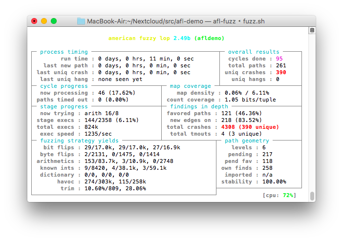

# Fuzz Testing Demonstration

This is a simple demonstration of how to fuzz-test a C++ program with the AFL ("American Fuzzy Lop") fuzz tester.



## What Is Fuzz Testing?

The goal of unit testing is to feed well-known input into your program and compare its output to the expected results.

The goal of fuzz testing (or fuzzing) is to feed random data into your program until it crashes.

## Files

* main.cpp: Our demonstration program.
* CMakeLists.txt: Build configuration.
* testcases: Example input for the program.
* fuzz.sh: Runs the AFL fuzzer.

## Running The Demonstration Program

The demonstration program consists of an (intentionally buggy) implementation of a URI decoder function and a simple main function that calls it with input read from stdin. A URI decoder converts hex sequences like `%2f` into the appropriate characters (in this case, `/`).

### Build The Program

```sh
$ cd afl-demo
$ mkdir build
$ cd $_
$ cmake ..
$ make
```

### Try It Out

The afldemo program reads URI encoded input from stdin and decodes it to stdout.

```sh
$ cd afl-demo/build
$ ./afldemo <<<Hello+World%21
Hello World!
```

Looks ok, doesn't it? Now wait and see ...

## Fuzzing The Demonstration Program

Replace `2.49b` by the appropriate version of AFL (that is, what afl-latest.tgz unpacks into).

### Download And Build AFL

```sh
$ cd your-preferred-directory
$ mkdir afl
$ cd $_
$ wget http://lcamtuf.coredump.cx/afl/releases/afl-latest.tgz
$ tar xzf afl-latest.tgz
$ cd afl-2.49b/
$ make
```

### Create Initial Test Cases

To get AFL started, give it some legal input that your programm processes. Create one file per input string in the `testcases`directory.

```sh
$ cd afl-demo
$ mkdir testcases
$ cd $_
$ echo your test input >name.txt
```

### Build The Instrumented Test Program

```sh
$ cd afl-demo
$ mkdir aflbuild
$ cd $_
$ CC=/path/to/afl/afl-2.49b/afl-gcc CXX=/path/to/afl/afl-2.49b/afl-g++ cmake ..
$ make
```

### Run The Fuzzer

```sh
$ cd afl-demo/aflbuild
$ /path/to/afl/afl-2.49b/afl-fuzz -i ../testcases -o ../findings ./afldemo
```

Or, when using this demonstration project, use the provided shell script that builds the instrumented executable and runs the fuzzer. Edit `fuzz.sh` first and set variable `AFL` to the directory in which you built AFL.

```sh
$ cd afl-demo
$ ./fuzz.sh
```

### Evaluating The Fuzzer Results

Let the fuzzer run until it finds one or more crashes or hangs, then terminate it with ^C. Fuzzing can take a considerable time (hours or days depending on the complexity of your program).

You find the input that made the program crash or hang in the `findings/crashes` and `findings/hangs` directories. Debug and fix your program until it processes the input cleanly (it may be a good idea to add AFL's findings to your suite of unit tests). Repeat (you may want to `rm -fr findings` for a fresh start).

## Resources

AFL homepage: http://lcamtuf.coredump.cx/afl/

About fuzz testing: https://en.wikipedia.org/wiki/Fuzzing

The OSS Fuzz project: https://github.com/google/oss-fuzz

---
*Wolfram Rösler • wolfram@roesler-ac.de • https://twitter.com/wolframroesler • https://github.com/wolframroesler*

